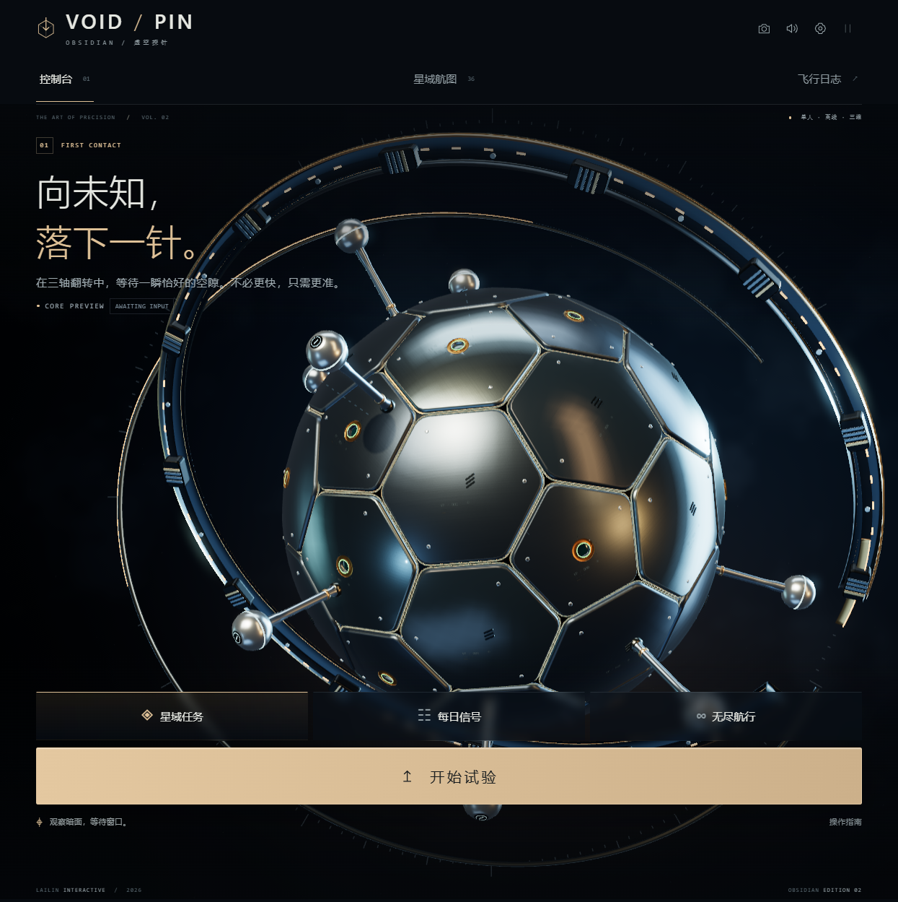
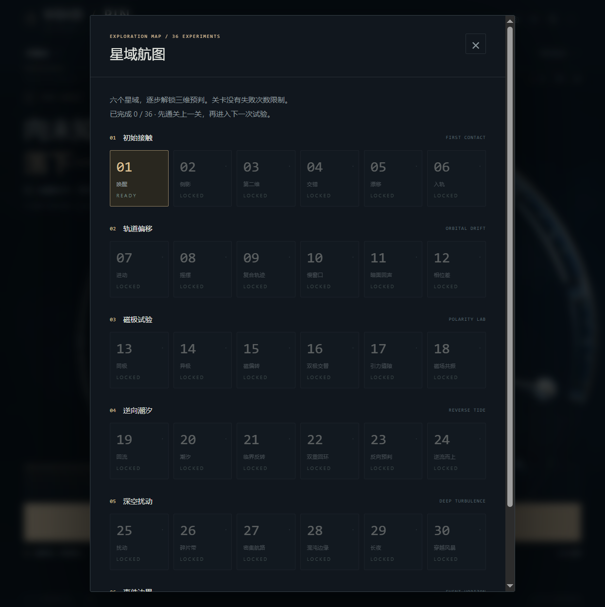
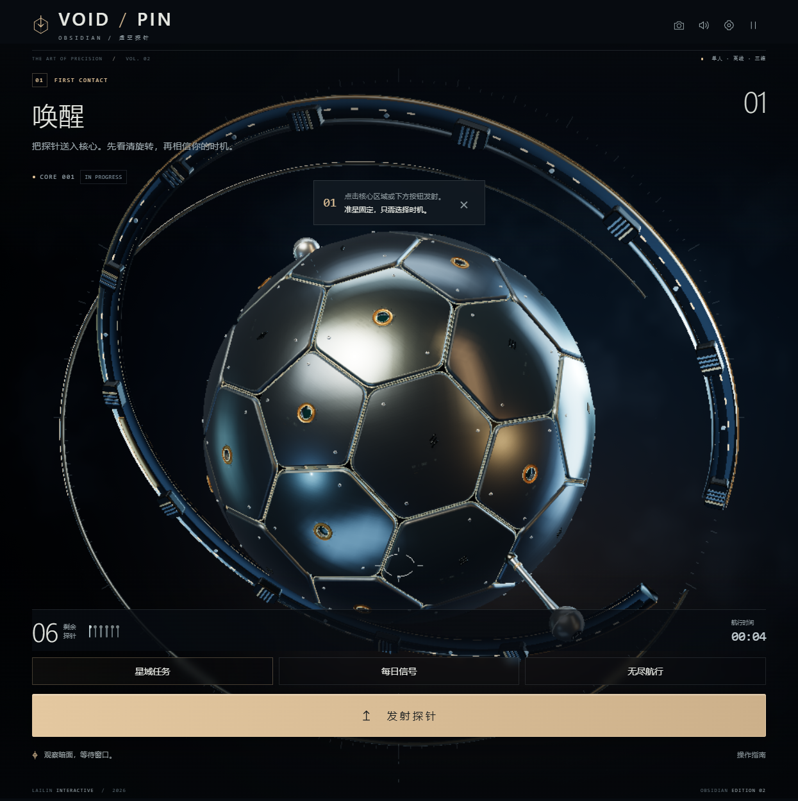
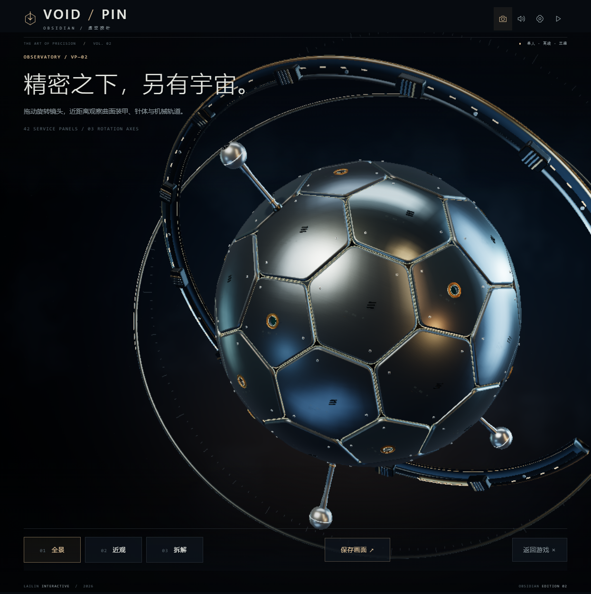

# VOID / PIN · OBSIDIAN

一款围绕三轴旋转黑曜石核心展开的极简 3D 时机反应与空间干涉游戏。观察立体空隙，将探针精准植入多轴旋转的致密核心，在动态三维交错中规避针体碰撞。

## 作品截图

<table>
  <tr>
    <td width="50%"> 星域航图：六个区域与 36 个递进关卡</td>
    <td width="50%"> 实战界面：观察三轴旋转并选择发射时机</td>
  </tr>
  <tr>
    <td colspan="2"> 核心观测室：近距离检查结构、针体与机械轨道</td>
  </tr>
</table>

## 作品定位与核心机制

- **三轴角动量核心**：核心拥有独立的三轴变速自转、周期性角动量翻转与磁极偏角突变，呈现复杂的空间动态姿态。
- **空间干涉规避**：针体植入后随核心旋转成为新的物理障碍，需精准推演立体空隙并进行预判发射。
- **36 个递进星区关卡**：涵盖 6 大主题星域、阶梯式角速度扰动、每日统一挑战与无尽挑战模式。
- **视觉盲区辅助**：引入半透明背面轮廓提示与自适应高光，平衡三维空间深度感知与操作容错。

## 技术架构与算法实现

项目采用**高模块化命名空间架构**（`VP.math` / `VP.core` / `VP.optics` / `VP.audio`），在单文件封装下依然保持生产级清晰度：

### 1. 四元数姿态动力学与空间干涉解算 (`VP.math` / `VP.core`)
- **四元数角动量积分**：全面舍弃欧拉角，使用四元数（Quaternion）对三轴自转进行微分增量累加，彻底规避万向节死锁（Gimbal Lock），保证核心在任意极端倾角下的平滑姿态解算。
- **球面角距离碰撞判定**：发射探针时，将击中点坐标转换至核心局部球坐标系，与所有已植入针体的位置向量进行球面点积（Spherical Angular Distance）计算，毫秒级判定临界干涉距离与擦碰爆破。

### 2. 自研紧凑型 HDR 光学管线 (`VP.optics`)
- **轻量后处理替代方案**：零额外引入笨重的标准 Post-processing 依赖包，通过自写着色通道实现高光阈值截断（Luminance Thresholding）、微量曝光衰减与色调映射（Reinhard Tone Mapping）。
- **黑曜石与晶体材质**：在原生 WebGL 基础着色器上微调高镜面反射比率与菲涅尔效应，打造高反差、致密深黑的工业艺术质感。

### 3. 确定性模拟与程序化音频 (`VP.audio`)
- **零环境依赖的纯逻辑内核**：`VP.core` 完全脱离 DOM 与 Three.js 渲染上下文，支持确定性快照恢复与时间步进推演。
- **Web Audio 脉冲声效**：完全基于代码振荡器合成低频脉冲轰鸣、刺针高速发射气压音与高能干涉破碎音，无任何外置音频文件。

## 交付标准与工程规范

- **开箱即用单文件交付**：HTML、CSS、JavaScript 与内嵌 Three.js r185 深度绑定，本地无服务直接打开 `index.html` 即刻体验。
- **多端触控与无障碍支持**：适配桌面端空格击发与移动端触屏点按；原生适配 `prefers-reduced-motion` 动效过滤，降低长时间观察旋转核心带来的视觉疲劳。
- **多星区进度持久化**：支持 36 关通关星级、无尽模式分数及画质偏好本地持久化与一键重置。

## 工程能力迁移与应用场景

本项目中实现的物理姿态解算与紧凑管线可直接类比并迁移至以下业务场景：
- **三维空间姿态传感与设备联动（IMU）**：将“基于四元数的三轴角动量积分与防万向节死锁解算”迁移至空间穿戴设备、无人机空间航向监控、机器人关节末端姿态追踪等工业物联网数据大屏。
- **球坐标系空间防碰撞预警**：将“局部球坐标系角距离相交裁决”迁移至雷达探测阵列、无人机近距编队避障预警以及密集空间点阵的临界干涉安全距离筛查。
- **极致性能的 3D 交互微端**：将“自研紧凑 HDR 光学管线与纯代码资产”迁移至免下载高质感交互模型展示、智能座舱三维旋钮控制组件及跨端轻量 H5。

## 快速游玩与操作

1. **直接游玩**：下载仓库后，用桌面版 Chrome 或 Edge 直接双击打开 `index.html`。
2. **操作说明**：
   - 观察中央黑曜石核心旋转韵律；
   - 敲击键盘 `Space`（空格键）或点击屏幕发射一枚探针；
   - 将当前关卡全部探针成功植入且不发生任何碰撞即判定通关。

## 版权

作品代码与原创内容保留全部权利。内嵌的 Three.js 使用 MIT License，许可正文随 `index.html` 一并分发。
